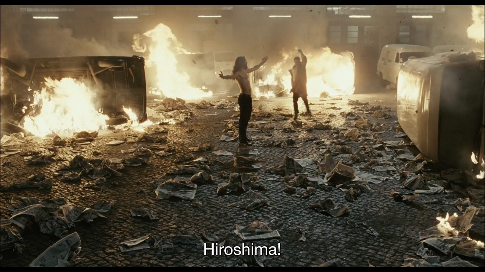
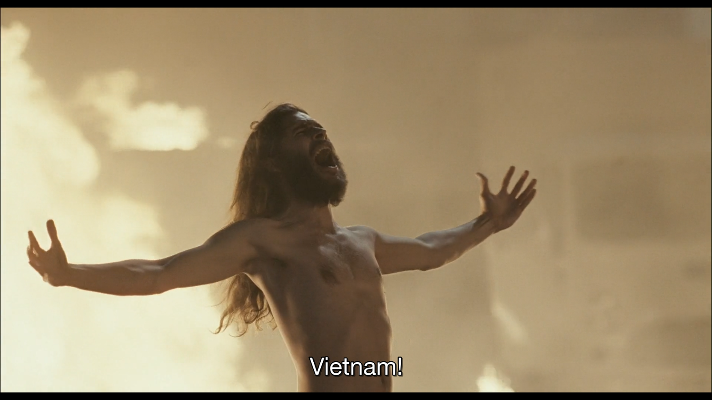
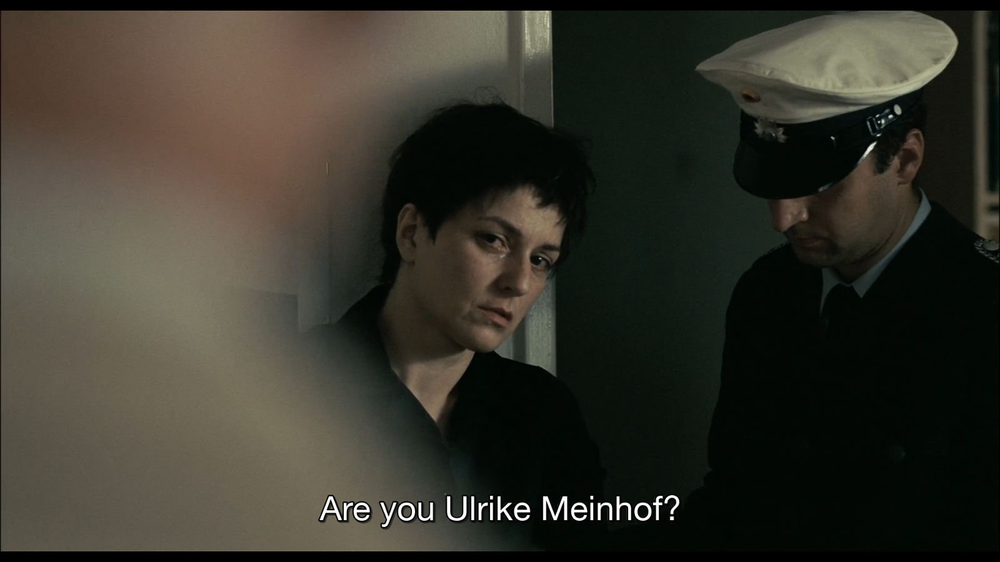

:title: Der Baader Meinhof Komplex
:date: 2020-02-24
:slug: baader-meinhof
:category: Notes

Here are some stills from the 2008 film *Der Baader Meinhof Komplex*,
directed by Uli Edel.
It is a historical drama about the `Red Army Faction
<https://en.wikipedia.org/wiki/Red_Army_Faction>`__ (RAF).

.. figure:: ./media/baader-meinhof/Ho\ Chi\ Min.png
   :align: center 

   Rudi Dutschke leads a crowd in chanting "Ho Chi Min"

.. figure:: ./media/baader-meinhof/I\ am\ dead,\ let\ me\ live.png
   :align: center

   Rudi Dutschke after being shot by a would-be assassin

.. figure:: ./media/baader-meinhof/Father,\ mother.png
   :align: center

.. figure:: ./media/baader-meinhof/Soldier,\ soldier.png
   :align: center

.. figure:: ./media/baader-meinhof/Dresden.png
   :align: center

   Protest at the offices of Der Spiegel

.. figure:: ./media/baader-meinhof/I\ will\ never\ resign\ myself\ to\ nothing.png
   :align: center

   Gudrun Ensslin interviewed in prison by Ulrike Meinhof

.. figure:: ./media/baader-meinhof/that\ is\ only\ consistent.png
   :align: center

.. figure:: ./media/baader-meinhof/Cures\ the\ rigidity\ 1.png
   :align: center

   Andreas Baader on a joyride

.. figure:: ./media/baader-meinhof/Cures\ the\ rigidity\ 2.png
   :align: center

.. figure:: ./media/baader-meinhof/New\ morality.png
   :align: center

.. figure:: ./media/baader-meinhof/Draw\ a\ line\ between\ us\ and\ our\ enemies.png
   :align: center

.. figure:: ./media/baader-meinhof/The\ gun\ makes\ its\ statement.png
   :align: center

   Klaus Rainer Röhl reads a communiqué written by the RAF

.. figure:: ./media/baader-meinhof/Urban\ guerillas.png
   :align: center

   The RAF trains with the PLO

.. figure:: ./media/baader-meinhof/Revolution\ made\ 2.png
   :align: center

.. figure:: ./media/baader-meinhof/I\ shit\ on\ the\ policy.png
   :align: center

.. figure:: ./media/baader-meinhof/Emancipation\ pt\ 1.png
   :align: center

.. figure:: ./media/baader-meinhof/Emancipation\ pt\ 2.png
   :align: center

   Gudrun Ensslin rebukes Andreas Baader

.. figure:: ./media/baader-meinhof/Slander\ pt\ 1.png
   :align: center

   Gudrun Ensslin quotes Mao Tse-tung

.. figure:: ./media/baader-meinhof/Slander\ pt\ 2.png
   :align: center

.. figure:: ./media/baader-meinhof/Slander\ pt\ 3.png
   :align: center

   Arrest of Ulrike Meinhof

.. figure:: ./media/baader-meinhof/It's\ murder.png
   :align: center

   Holger Meins on hunger strike

.. figure:: ./media/baader-meinhof/What\ a\ shitty\ action.png
   :align: center

   Andreas Baader decries the RAF siege of the West German Embassy in Stockholm
