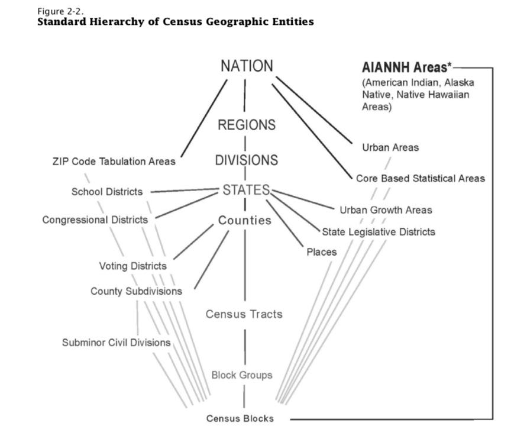
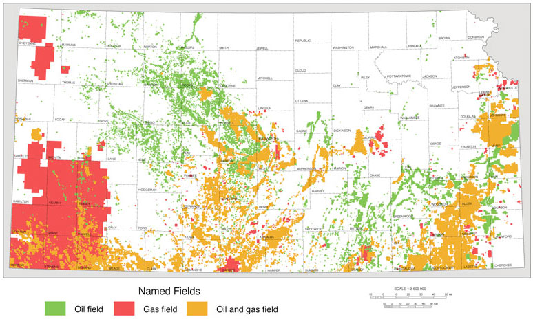

:title: Dental Demographics
:date: 2018-12-31
:modified: 2019-02-11
:category: Projects
:slug: dental-demographics

Introduction
------------

The profitability of a dental practice depends greatly on its
geographic location. The demographics of the patient population
in the area surrounding the practice affects the demand for
dental care (that is, the need and the means to pay). Key
characteristics are the age and income levels of the population.
Another location-dependent factor is the amount of competition
from other dental practices. An underserved area could be a good
place to start a new practice.

Most dental practices in the United States are privately owned.
A sole dentist or partnership will finance the opening of a new
dental practice themselves. Placing the practice in a location
that will be profitable is an important part of their business
strategy.

This is a concern even for dentists who do not own their own
practice. Dentists in the US are usually paid as a percent of the
amount of dental care they provide, which in turn is dependent of
the amount of business the practice can bring in.

In order to find suitable locations for a new dental practice, I
compiled demographic data from the US Census Bureau and records of
existing practices from online business directories. I confined
my search in the states of Kansas and Missouri, with a particular
focus on the metropolitan area of Kansas City, Missouri.

All of the code for this project can be found on Github_.

.. _Github: https://github.com/mmallicoat/dental-demographics

American Community Survey
-------------------------

I used demographic data from the `American Community Survey`_ (ACS)
published by the US Census Bureau. This survey contains data from
a five-year period, 2012–2016. The attributes collected include
age, sex, race, occupation, veteran status, insurance benefits,
and many others.

The ACS has some advantages over the `Decennial Census`_. It contains
many more attributes than the Census. The data is also aggregated
and published annually rather than every ten years, providing a
more up-to-date snapshot. One drawback is that the ACS only covers
a sample of the population rather than the population entire.

In the ACS, the finest granularity of the geographic component
is the Public Use Microdata Area (PUMA). These are generally
small geographic regions, containing no fewer than 100,000 people
(in order to ensure anonymity and statistical credibility). The
boundaries of the PUMAs do not cross state or county lines, so the
data can be aggregated at that level. The boundaries also do not
cross the Census Blocks and Census Tracts used in the Decennial
Census. [#]_

   The PUMA falls between the County and Census Tract granularities.

.. [#] They do, however, cross the boundaries of ZIP codes.

.. _`American Community Survey`: https://www.census.gov/programs-surveys/acs.html
.. _`Decennial Census`: https://www.census.gov/programs-surveys/decennial-census.html

Age and Income
--------------

Areas with higher incomes will spend more on dental care than
those with lower incomes. This is not surprising, especially in
the US where almost all dental care is paid for out-of-pocket or
by private insurance. [#]_ Areas with older populations will spend
more on dental care, because older people tend to have more dental
problems and also because of the positive correlation between age
and income/wealth. So, we will focus on these two demographic
attributes in considering a location.

Below is snippet of the statistics for each PUMA in Kansas (state
code 20 [#]_) and Missouri (state code 29).

====== ===== =========== ======================== =========== =========================
State  PUMA  Population  Median Household Income  Median Age  Percent Aged 60 or Older 
                         (2016 Dollars)                                                
====== ===== =========== ======================== =========== =========================
20     100   109,867     $41,200                  41          26.7%                    
20     200   147,564     $42,318                  41          25.7%                    
20     300   134,983     $32,714                  26          12.2%                    
20     400   122,120     $42,564                  37          20.5%                    
20     500   161,762     $40,129                  33          16.5%                    
20     601   116,104     $81,513                  38          18.3%                    
20     602   153,179     $65,904                  37          22.5%                    
20     603   158,524     $69,349                  34          13.6%                    
20     604   144,839     $106,734                 39          18.9%                    
20     700   116,206     $26,172                  29          15.3%                    
====== ===== =========== ======================== =========== =========================

I also visualized these results using QGIS_.

.. figure:: ./figures/median-household-income.png
   :alt: Median Household Income
   :align: center

   Higher median household incomes are shown in darker shades.

We see that the highest income areas in these two states are
in the suburbs of Kansas City and Saint Louis, on the western
and eastern borders of Missouri. There are also slightly higher
incomes in the suburbs of Topeka (in north–central Kansas) and
Wichita (in south–central Kansas).

.. figure:: ./figures/median-age.png
   :alt: Median Age
   :align: center

   Higher median ages are shown in darker shades.

The median age is generally higher in more rural regions. In the
areas where large universities are located, we see a much lower
median age than elsewhere. The youthful patches on the map can be
explained by Kansas State University in Manhattan, the University
of Kansas in Lawrence, the University of Missouri in Columbia, and
Missouri State University in Springfield.

An outlier in income and age is southwest Kansas: it has unusually
high incomes and unusually young population for a rural area.
My guess is that this is due to oil and gas exploitation in the
region, attracting young workers and paying relatively high wages.
See the chart from geological survey below.

   `Kansas Geological Survey, Public Information Circular (PIC) 32, December 2011
   <http://www.kgs.ku.edu/Publications/PIC/pic32.html>`__

.. _QGIS: https://en.wikipedia.org/wiki/QGIS

.. [#] The existing socialized medical programs in the US (e.g.,
    Medicaid and Medicare) generally do not provide dental coverage.
    One exception is Tricare, which does.

.. [#] The codes used in the ACS data accord with the 
    `Federal Information Processing Standard <https://en.wikipedia.org/wiki/Federal_Information_Processing_Standard_state_code>`__
    (FIPS) state codes.

Competition
-----------

A third consideration is the number of dental practices already
operating the region. The more dental practices there are, the
more competition. This leads to lower utilization of the capacity
of each dental practice and lower profitability.

To assess this, I scraped the listings of dentists and dental
practices from an online business directory. Since I wanted to
focus on the metropolitan area of Kansas City, I collected listing
from the region around Lenexa, Kansas, an inner-ring suburb. [#]_

Given the address of each dental practice, I used the `Open Street
Map`_ Nominatim_ API to geocode each location, looking up the
latitude and longitude coordinates for each street address.

The shapefiles_ provided by the Census Bureau for the PUMAs
contain the boundaries of these geographic regions. Using the
``fiona`` Python library, we can easily open and manipulate
shapefiles. In conjunction with the ``shapely`` library, we can
find which PUMA each of the dental practices is located in, by way
of its coordinates.

After removing duplicate locations from our list of dental
practices, we can then tabulate the number in practices in each
PUMA. One rule of thumb is that an ideal practice has 2000 active
patients. So, we would be looking for areas with around 2000 or
more people per practice.

.. figure:: ./figures/practice-count.png
   :alt: Population per Dental Practice
   :align: center

   Population per dental practice in the Kansas City area

According to our chart, southwest Johnson County (bottom left
PUMA) and western Kansas City (two PUMAs on right) have a suitable
ratio. Wyandotte County (top center PUMA) is somewhat underserved,
so it could be a profitable location for a practice. Southeast
Johnson County (bottom center PUMA) has the lowest ratio; however,
it is also the area with the highest median household income
Kansas or Missouri, so it may nevertheless be a good location.

.. _shapefiles: https://en.wikipedia.org/wiki/Shapefile
.. _`Open Street Map`: https://www.openstreetmap.org
.. _Nominatim: https://wiki.openstreetmap.org/wiki/Nominatim

.. [#] Since I did not scrape the entire business directory, only the
    data for the areas close to the origin of Lenexa, KS, can be
    expected to be reasonably complete.

Future Directions
-----------------

The attributes considered here may be a good start, but there are
other factors worth looking at. Future analysis could investigate
the dental insurance providers in the area and how much they will
pay for various dental procedures. The same procedure in one area
may be better compensated than in another due to the typical
insurance coverage of the patients.

The data quality of the existing dental practices could be
improved. The addresses scraped from the business directory were
quite dirty, having problems like:

* Some dentists are listed multiple times at different practices
* Some dental practices listed are no longer operating
* Errors in addresses for practices, such as the wrong city or ZIP code given

There is also little trust in the listings being complete. In the
future, there may be better sources for this information, such as
lists of in-network dental practitioners published by insurance
companies.

Open Street Map's Nominatim geocoding API seems to be less
tolerant to malformed addresses than Google Maps'. For a
commercial application, it would probably be worth paying for
Google's service.
