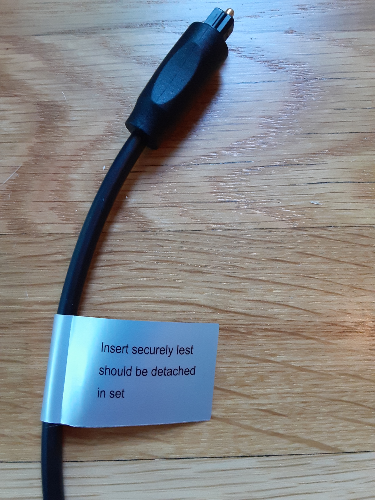

:title:  Found Poetry
:date:   2020-03-13
:modified: 2020-06-17
:slug: found-poetry
:category: Notes

.. contents:: Index

Fiberoptic Haiku
----------------

The admonition on the tag of this fiberoptic cord is broken into three little
lines like a haiku. 

The text reads:

.. line-block::

   Insert securely lest
   should be detached
   in set

The suspension after *lest* in the first line is quite good, as well as the
anticlimax of the last line.

A stylized bird with an open mouth, tweeting.
---------------------------------------------

While reading a news article [#article]_ with the w3m_ text-based Web browser,
I noticed some strange sentences interspersed in the markup gore you typically
see when reading the Web without JavaScript.

::

    The UK government warns Trump that war with Iran 'is in none of our interests'
    
    Adam Bienkov
    2020-01-03T10:33:25Z
     The letter F.  An envelope. It indicates the ability to send an email.  An
    image of a chain link. It symobilizes a website link url.  A stylized bird
    with an open mouth, tweeting.  The word "in".  A stylized letter F.
     Three evenly spaced dots forming an ellipsis: "...". Two crossed lines that
    form an 'X'. It indicates a way to close an interaction, or dismiss a
    notification.
    Donald Trump Boris Johnson Donald Trump Boris Johnson [5e0f163885]
    Donald Trump and Boris Johnson. Getty

The parts that stuck out to me were:

*   The letter F.
*   An envelope. It indicates the ability to send an email.
*   An image of a chain link. It symobilizes a website link url.

And so on. What are these things anyway? Looking at the source of the page,
I saw it has a bunch of icons which are also hyperlinks. The icon class
contains a non-standard HTML tag ``<desc>`` which contains a description
of the icon (perhaps in a gesture of accessibility toward people with vision
impairment). The icon block looks something like this:

.. code:: html

    <a href="https://www.facebook.com">
        <svg class="svg-icon facebook-icon">
            <title id="title">Facebook Icon</title>
            <desc id="desc">The letter F.</desc>
        </svg>
    </a>
 
The body of the ``<desc>`` element get dumped into the visible text in the w3m
browser. I wrote a little Python script to extract these descriptions.

.. code:: python

    import re

    with open('news_article.html', 'r') as f:
        article = f.read()
    
    snippets = re.findall(r'<desc id="desc">(.*)<\/desc>', article)
    
    with open('snippets.txt', 'w') as f:
        f.write('\n'.join(snippets))

Finally, here are all these little snippets standing alone, with the article
and other junk stripped out. Read together, they have some majesty.

.. line-block::

    A vertical stack of three evenly spaced horizontal lines.
    A magnifying glass. It indicates, "Click to perform a search".
    The words "Business Insider".
    An icon in the shape of a person's head and shoulders. It often indicates a user profile.
    An icon in the shape of a person's head and shoulders. It often indicates a user profile.
    The word Business
    The word Life
    The word News
    A magnifying glass. It indicates, "Click to perform a search".
    The word "Insider".
    Two crossed lines that form an 'X'. It indicates a way to close an interaction, or dismiss a notification.
    The word Business
    The word Life
    The word News
    The word All
    An icon in the shape of a person's head and shoulders. It often indicates a user profile.
    An icon in the shape of a person's head and shoulders. It often indicates a user profile.
    An icon of the world globe, indicating different international options."
    The letter F.
    A stylized bird with an open mouth, tweeting.
    The word "in".
    A play button in the shape of a television screen.
    A stylized camera.
    The letter F.
    An envelope. It indicates the ability to send an email.
    An image of a chain link. It symobilizes a website link url.
    A stylized bird with an open mouth, tweeting.
    The word "in".
    A stylized letter F.
    Three evenly spaced dots forming an ellipsis: "...".
    Two crossed lines that form an 'X'. It indicates a way to close an interaction, or dismiss a notification.
    A check mark. It indicates a confirmation of your intended interaction.

----

.. _w3m: https://en.wikipedia.org/wiki/W3m

.. [#article] Bienkov, Adam. "The UK government warns Trump that war with Iran 'is in none of our interests'."
    *Business Insider*, 3 Jan. 2020,
    `<https://www.businessinsider.com/uk-warns-donald-trump-against-launching-war-iran-qassem-soleimani-2020-1>`__.
    Accessed 13 March 2020. 

