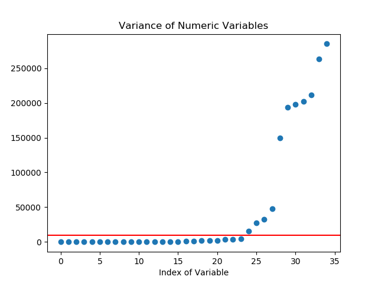
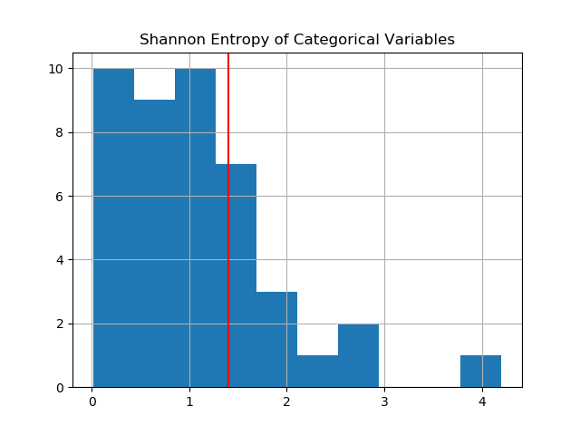
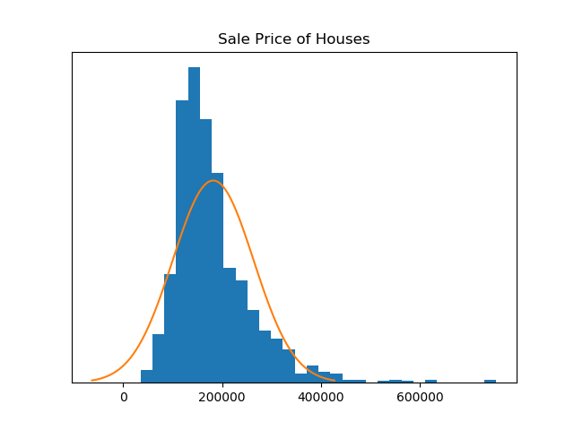
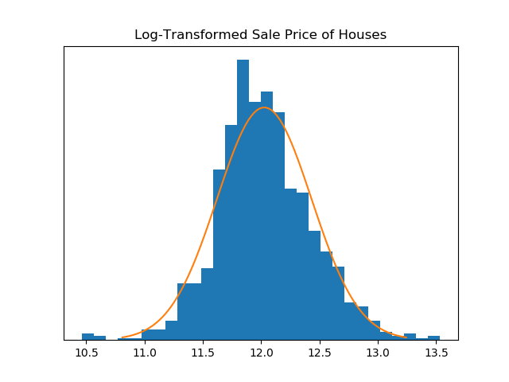

:date: 2018-11-12
:modified: 2018-11-12
:title: Predicting House Prices
:category: Projects
:slug: kaggle-house-prices

Introduction
------------

The data science company Kaggle administers many predictive
modeling competitions, one of which focuses on `predicting house prices
<https://www.kaggle.com/c/house-prices-advanced-regression-techniques>`__.
The problem posed is to predict the price of a house given a large
number of features of the house: the number of stories, the floor
area, the number of bedrooms, the size of the yard, and so on.
The data are from houses in Ames, Iowa, compiled for use in data
science education.

To solve the problem, I developed a Generalized Linear Regression
(GLM) model. The GLM model works by fitting a function to the
features of houses with known prices; then, to predict the price
of an additional house, the estimated function is evaluated with
the house's particular features. The function takes the form of a
*hyperplane* (a generalization of the plane to higher dimensional
space). Usually the response variable, in our case the house
price, is transformed before the fitting takes place.

The code for this project can be found on GitHub_.

.. _GitHub: https://github.com/mmallicoat/kaggle-house-prices

Data Prep
---------

The first step I took was to stratify the data provided,
complete with the price of each house, into training and
cross-validation (CV) datasets. Having a CV dataset lets you
compare the performance of models on out-of-sample data, thereby
avoiding overfitting and getting a more accurate estimate of its
performance. I randomly partitioned the labeled dataset into the
training and CV datasets, since I do not know if there is some
order to how they are presented in the file Kaggle provides which
might bias my model.

Next, I dealt with any missing values in the dataset. For numeric
variables, I calculated the mean of the variable in the training
data and substituted this value for any missing in the training
and CV datasets. For the categorical variables, I substituted a
new value "Unknown."

To select from the many features, I used some simple heuristics.
For the numeric variables, I calculated the variance of each
within the training data. I produced a scatter plot of the
variances of the variables, sorted in ascending order. In this
plot, I found an "elbow" where there was a significant drop-off
in variance. I then selected all variables with variance above
this threshold. This amounted to 12 variables, about a third of
the numeric variables available. The rationale behind this is that
variables with low variance do not provide much discriminating
information between houses, since all of the houses will have
similar values.

   "Elbow" in the plot of variances of numeric variables

For each of the categorical variables, I calculated the entropy_,
assuming each value was pulled from a multinomial distribution.
Entropy is a measure of the amount of "information" contained in
a stochastic process. Random variables with little "surprise" in
their realized values will have low entropy. For binary variables,
the entropy calculated is equivalent to the variance of the
corresponding Bernoulli distribution. After calculating the
entropy, I plotted a histogram, found an "elbow" is use for the
threshold, and selected all of the variables above this threshold,
in the same manner as the numeric variables. This amounted to 14
variables, about a third of the categorical variables available.

   "Elbow" in the histogram of entropy of categorical variables

.. _entropy: https://en.wikipedia.org/wiki/Entropy_(information_theory)

The selected categorical variables were then encoded as dummy
variables, [#]_ so that they can be included in the regression.
One trip-up was that there are values of categorical variables
appearing in the test data that do not appear in the training/CV
data. The universe of values must be known ahead of time in order
to encode the variable as dummy variables. Given a new dataset
containing unseen values of a categorical variable, the model
could not be applied.

It is somewhat challenging to develop a processing pipeline
that can be applied to all datasets uniformly, particularly
when the processing procedure is "fitted" to the training data.
The processing must then be applied to training data first, the
parameters estimated, and those parameters stored somewhere so
that they can be applied when processing the CV and testing
datasets. Instead of writing out the parameters to disk, as I did
for the scaler and regression parameters, I simply kept them in
memory and processed all of the datasets at once. This is less
than ideal, since I wouldn't have the parameters readily available
to apply to a new dataset, which would be necessary if this model
were used in an application.

.. [#] Dummy variables are a collection of binary variables whose
    combination correspond to one of the values of the categorical
    variable. The simplest example is a variable with possible values
    "Male" and "Female" being encoded as 1 and 0. For variables with
    *n* possible values, *n - 1* dummy variables are required.

Training
--------

Before training the model, I performed some transformations on
the data. I standardized the features, subtracting the mean and
dividing by standard deviation to create features with zero mean
and unit variance. If the features have different scales, the
magnitude of the fitted coefficients in the linear model will be
influenced by the scale of the underlying variables and harder to
compare. Coefficients of variables with a larger scale would also
be penalized more highly if regularization is applied.

Another transformation was to take the logarithm of the sale
price response variable. There are two reasons for this: First,
like most currency values, the house prices in the data are not
normally distributed, which violates an assumption of the linear
regression. This can be seen in the histogram below over which
I've overlaid a fitted normal distribution.

By log-transforming the response variable, it is much closer to
following a normal distribution. [#]_

Secondly, the loss function specified for the Kaggle competition
is the mean squared error of the *logarithm* of the house prices
predicted. If we wish to develop a model that performs well under
this loss function, we must optimize the parameters of our model
with respect to it.

My initial model resulted in some very large positive and negative
coefficients in the fitted model. Due to the limited precision
of floating point arithmetic, these coefficients lead to some
overflows and underflows_, respectively, in the predicted value of
the response variable. To remedy this, I used a ridge regression
instead, which adds a regularization term to the loss function
used for fitting the model, thereby penalizing coefficients with
large magnitude. This solved the problem of unreasonable large
coefficients.

.. _underflows: https://en.wikipedia.org/wiki/Arithmetic_underflow

After training the model, I saved the parameters of both the
standardization procedure and the linear regression. These are
both are needed in order to repeat the preprocessing steps and
make predictions from the CV and test datasets.

.. [#] Processes that are the sum of many independent occurrences
    generally follow a normal distribution, which is consistence with
    the Central Limit Theorem. An example of this is human height,
    which is perhaps the result of the expression of many different
    genes, the quality of nutrition through each phase of childhood,
    the effects of childhood disease, etc., which are generally
    independence events, each having a small effect. Processes like
    prices or salaries cannot be normally distributed on the face
    since they cannot have negative values. Secondly, instead of the
    constituents having an additive effect, they seem to have more of
    a *multiplicative* effect on the outcome. Learning two new skills
    will increase your salary more than that sum of each alone.

Prediction
----------

To make predictions given the CV and test datasets, the
preprocessing steps and repeated:

1. Standardize the variables using means and standard deviations
   from training dataset
2. For the CV dataset, log-transform the response variable. (We do
   not know the value of the response variable for the testing data,
   of course.)
3. Apply our regression model to make a prediction: multiply
   values of the features by the fitted coefficients, sum these up,
   and add the intercept.
4. For the CV dataset, calculate the value of the loss function as
   a diagnostic.
5. Before writing out the predictions, reverse the log-transform
   by exponentiating the predicted value.

The Kaggle competition is judged by the square root of the mean
squared error (RMSE) of the predictions of the log-transformed
house prices. This metric for our model (on the test dataset) is
0.168, which is fairly middling compared to the leaderboard on the
Kaggle website. For the CV dataset, the metric is 0.166, which is
close to that of the test dataset, as we would expect.

The metric is somewhat difficult to interpret, so I calculated the
RMSE of the *un*-transformed prices for comparison. The RMSE for
the untransformed prices in the CV dataset is $37,576. This is
very roughly [#]_ the expected deviation of our prediction from
the true price. The mean house price in this dataset is $178,186;
so, although our error is significant, the predictions are within
the ballpark of the true values.

There are many avenues to explore which could improve the
model's performance. Here are some things to try in the future:

*   Engineer some custom features, especially ones that capture
    interactions between variables. These might be something like the
    ratio of bathrooms to bedrooms, or ratio of plot area to house
    floor area.
*   Make use of the ordinal variables: there are some variables that
    are actually ordinal, not categorical. An example of this is X.
    Instead of ignoring the ordering of the levels of the variable,
    they could be taken advantage of.
*   Try some alternate models, especially those that can fit
    non-linear functions. There may be some non-linear interactions
    between the house price and the independent variables, such as
    the price not being monotonically increasing with the value of an
    independence variable. One plausible explanation of this might be
    something along the lines of: a larger yard may correlate with a
    more valuable property, but it may correlate with a more rural
    location; the negative effect of the rural location on the house
    price might outweigh the increase from the larger yard.
*   Supplement external data: we are given the names of
    neighborhoods of the houses. There is publicly available data on
    houses and their prices from these locations. This data could be
    collected and used to supplement the data provided by Kaggle. Or,
    a secondary model could be built from the external data and then
    combined with the model trained on the Kaggle data in an ensemble.

.. [#] The RMSE is in fact the standard deviation of the
    residuals, which are the differences between each prediction and
    true value. The standard deviation is the square root of the
    expected squared deviation, rather than the expected deviation.
