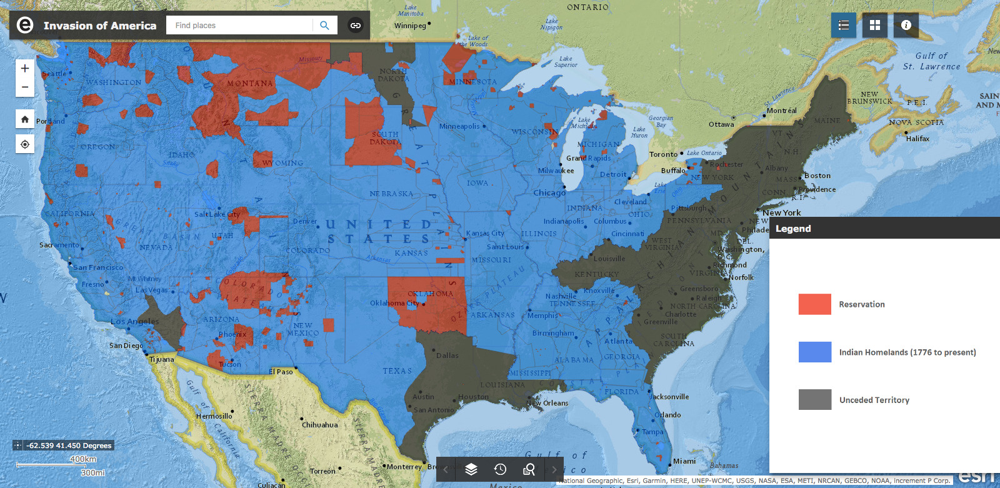
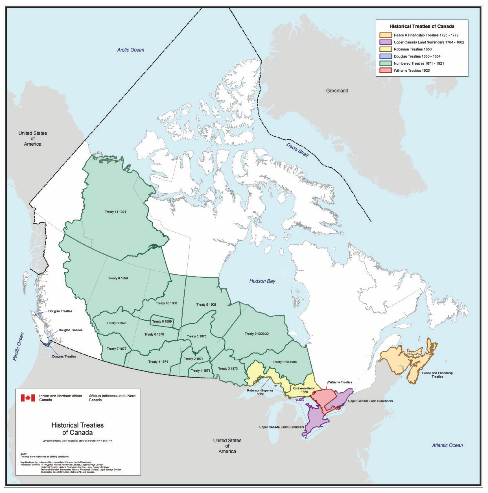
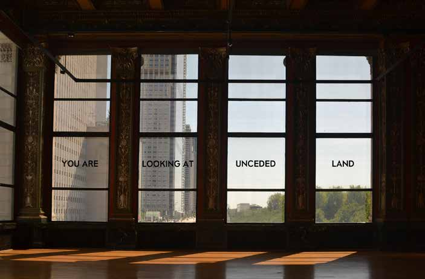

:title: Indigenous Land
:date: 2019-08-24
:modified: 2019-11-16
:slug: land
:category: Notes

.. contents:: **Contents**

Introduction
------------

Sometime in 2018, I came across the website of game designer `Avery Alder`_.
I noticed that she described where she lived as "in the Slocan Valley, in
Sinixt and Ktunaxa Territory," and not as "British Columbia, Canada."

She elaborates on her motivations in a series of `Tweets
<https://twitter.com/lackingceremony/status/1041008025413181440>`__ (on 15
September 2018):

    I frequently get cited as a 'Canadian game designer', and for the record I
    am always bothered by that. I'm a designer on unceded Sinixt territory, and
    previous to moving I was a designer on unceded Squamish, Musqueam, and
    Tsleil-Waututh territory'

    as a settler on unceded land, I do not want my work attributed to Canada,
    nor do I want to be involved in any assertion of its primacy over this land.

    [...]

This was my first introduction to the concept of "unceded territory." Doing
some searches on the Web for this term introduced me to the practice of "land
acknowledgements." These are both connected to the project of decolonization,
which I now realize I know woefully little about.

As I learn more about this complex relationship between land and people, I want
to collect some of the resources I find and share them on this page.

.. _`Avery Alder`: https://averyalder.com/

Unceded Territory
-----------------

In North America, colonial powers entered into numerous treaties with native
peoples to acquire land in exchange for goods and currency. In this way huge
portions of North America, via convoluted "chains of title," came to be claimed
by what are now Canada and the United States. [#na]_ For much of the land in
these two states, the government can point to a particular legal document which
enacted the transfer in ownership.  But for large expanses of the land, Canada
and the US do not possess even the most tenuous legal claim. This land is
considered "unceded."

In the United States, the most obvious tract of unceded territory is the land
around the original 13 British colonies on the Eastern seaboard. Another
notable piece is eastern Texas, which was "[s]eized by force of arms by the
Republic of Texas and the United States in the nineteenth century." [#us_map]_



In Canada up until 1975, most of British Columbia, Québec, Yukon, and Nunavut
were unceded territory.  Since then, there have been some new treaties seeking
to fill in these gaps, such as the 1975 `James Bay and Northern Quebec
Agreement
<https://en.wikipedia.org/wiki/James_Bay_and_Northern_Quebec_Agreement>`__ and
the 1993 `Nunavut Land Claims Agreement
<https://en.wikipedia.org/wiki/Nunavut_Land_Claims_Agreement>`__. Below is
where things stood before 1975. The white areas of the map were those not
covered by any treaty. [#ca_map]_



As of 2019, I live in Chicago, Illinois. As best I can tell, the land underneath the
city center was ceded to the United States in the Treaty of Greenville in 1795.
The counterparty to the treaty was the `Western Confederacy
<https://en.wikipedia.org/wiki/Western_Confederacy>`__, a confederacy of Native
American nations in the Great Lakes region. Among other terms, this treaty
ceded six square miles around the mouth of the Chicago River at Lake Michigan,
an important portage between the Great Lakes and the Mississippi River.

The shoreline with Lake Michigan has been pushed back since the Treaty of
Greenville, the lake filled in with debris from the Great Chicago Fire of 1871
and by later efforts in order to create more land. As a result, much of the
coastal land in this area is not part of any treaty. Here is a diagram from
*Mapping Chicagou/Chicago* illustrating this. The red areas show the original
waterways. [#mapping]_

.. figure:: ./media/shoreline-unceded-land.png
   :alt: Chicago shoreline with Lake Michigan over time
   :align: center

Because this "new" land was never covered by any treaty, the authors
characterize it as unceded. Below is a photo of an installation piece at the
Chicago Cultural Center's 2019 Architecture Biennial (also taken from *Mapping
Chicagou/Chicago*). These windows face east over Michigan Avenue, a street
which originally ran along the lake shore.



.. [#mapping] *Mapping Chicagou/Chicago: A Living Atlas.* Settler Colonial City Project, 2019.
    Available `online here <https://settlercolonialcityproject.org/Mapping-Chicagou-Chicago>`__.
    ISBN 978-0-578-56262-9

.. [#na] I have focused on Canada and the United States here. In the future I
    may try to learn more about the colonial history of Meso/Central America and
    the Carribean, as well as South America.

.. [#us_map] This image is from the map accompanying Claudio Saunt's book *West of
    the Revolution*. See `United States`_ section for more information.

.. [#ca_map] This map is from the `RCAANC / CIRNAC
    <https://www.rcaanc-cirnac.gc.ca/eng/1100100032297/1544716489360>`__. See Canada_ section
    for more information.

Land Acknowledgement
--------------------

A *land acknowledgement* (as it is sometimes called) is a public statement
acknowledging the original habitants of the physical space that the audience
now occupies. It acknowledges the existence and legitimacy of the original
peoples and that those gathered there are *guests*. It acknowledges the history
of colonialism and displacement of indigenous peoples.

They are usually made at public events—like lectures, arts performances, sports
matches—and by public institutions that occupy space such as schools and
universities.

When I first learned of the concept, it seemed to be a practice that had only
gained a foothold in Canada (and possibly other "progressive" former British
colonies like Australia and New Zealand) and not in my native United States.
But since I've become aware of the idea, I have stumbled on a couple land
acknowledgements here.

Chicago Cultural Center
```````````````````````

The Settler Colonial City Project (SCCP), [#SCCP]_ in partnership with the
American Indian Center of Chicago (AIC), [#AIC]_ were contributors to the 2019
Chicago Architecture Biennial held at the Chicago Cultural Center. The SCCP was
commissioned to attempt the insurmountable task of "decolonizing the Chicago
Cultural Center." As part of this project the AIC drafted a land
acknowledgement. The preface to the acknowledge provides some context for this
type of statement: [#decolonizing]_

    In recent years it has become a trend to acknowledge the traditional
    homelands of the Indigenous peoples of a particular area through a land
    acknowledgement.  This type of activity is designed to bring more awareness and
    understanding of the history of Indigenous people and their territories. But a
    land acknowledgement should also be more than that; it should be a call to
    rethink one's own relationship with the environment and the histories of all
    peoples. [...]
    
The acknowledgement itself, displayed at the entrance of the Chicago Cultural
Center, read:

    Chicago is part of the traditional homelands of the Council of the Three
    Fires: the Odawa, Ojibwe, and the Potawatomi nations. Many other tribes—such as
    the Miami, Ho-Chunk, Sac, and Fox—also called this area home. Located at the
    intersection of several great waterways, the land naturally became a site of
    travel and healing for many tribes. Today, Chicago is still a place that calls
    people from diverse backgrounds to live and gather. American Indians continue
    to live in the region, and Chicago is home to the country's third-largest urban
    American Indian community, which still practices its heritage and traditions,
    including care for the land and waterways. Despite the numerous changes the
    city has experienced, its American Indian and architecture communities both see
    the importance of the land and of this place, which has always been hospitable
    to many difference backgrounds and perspectives.

.. [#SCCP] The `Settler Colonial City Project <https://settlercolonialcityproject.org>`__
    is a research collective which explores cities as sites of ongoing settler colonialism and Indigenous resistance.

.. [#AIC] The `American Indian Center of Chicago <https://www.aicchicago.org>`__
    is cultural and community center serving Native Americans in the Chicago area.

.. [#decolonizing] *Decolonizing the Chicago Cultural Center.* Settler Colonial City Project, 2019.
    Available `online here <https://settlercolonialcityproject.org/Decolonizing-the-Chicago-Cultural-Center>`__.
    ISBN 978-0-578-56876-8

University of Illinois
``````````````````````

During the 2019 season of the Krannert Center for the Performing Arts,
[#krannert]_ the programs handed out at
performances included a land acknowledgement. The text from the program of a
play I attended reads:

    The University of Illinois System carries out its mission in its namesake
    state, which includes the traditional territory of the Peoria, Kaskaskia,
    Piankashaw, Wea, Miami, Mascoutin, Odawa, Sauk, Mesquaki, Kickapoo, Potawatomi,
    Ojibwe, Menominee, Ho-Chunk, and Chickasaw Nations. These lands continue to
    carry stories of these Nations and their struggles for survival and identity.
    
    As a land-grant institution, the University of Illinois has a particular
    responsibility to acknowledge the peoples of these lands, as well as the
    histories of dispossession that have allowed for the growth of this institution
    for the past 150 years. We are also obligated to reflect on and actively
    address these histories and the role that this university has played in shaping
    them. This acknowledgement and the centering of Native peoples is a start ass
    we move forward for the next 150 years.
    
    Krannert Center affirms the commitment by the university to move beyond these
    statements, toward building deeper relationships and taking actions that uphold
    and preserve Indigenous rights and cultural equity.
    
    [...]

Some context for the University's acknowledgement is provided on `its website
<https://www.uillinois.edu/about/land_acknowledgement>`__. The text of the
acknowledgement itself is also published on the `website for the Office of the
Chancellor <https://chancellor.illinois.edu/land_acknowledgement.html>`__.

.. How to cite this performance program?

.. [#krannert] Krannert Center is located on the campus of the University of
    Illinois at Urbana–Champaign. It is owned and administered by the University.

Canadian Association of University Teachers
```````````````````````````````````````````

The `Canadian Association of University Teachers <https://www.caut.ca/>`__
(CAUT) has a published a `guide
<https://www.caut.ca/content/guide-acknowledging-first-peoples-traditional-territory>`__
on land acknowledgements for Canadian universities along with recommended text.

The acknowledgement for the University of Toronto (provided by the University
itself) reads:

    1/ We [I] would like to begin by acknowledging that the land on which we gather
    is the traditional territory of the Wendat, the Anishnaabeg, Haudenosaunee,
    Métis, and the Mississaugas of the New Credit First Nation.
    
    2/ I (we) wish to acknowledge this land on which the University of Toronto
    operates. For thousands of years it has been the traditional land of the
    Huron-Wendat, the Seneca, and most recently, the Mississaugas of the Credit
    River. Today, this meeting place is still the home to many Indigenous people
    from across Turtle Island [#turtle]_ and we are grateful to have the
    opportunity to work on this land.
    

.. [#turtle] *Turtle Island* is a name for the North American continent originally drawn
    from Lenape folklore, per `Wikipedia <https://en.wikipedia.org/wiki/Turtle_Island_(North_America)>`__.

Maps and Treaties
-----------------

Canada
``````

The Relations Couronne-Autochtones et Affaires du Nord Canada (RCAANC) /
Crown-Indigenous Relations and Northern Affairs Canada (CIRNAC) department of
the Canadian government has published a `series of maps
<https://www.rcaanc-cirnac.gc.ca/eng/1100100032297/1544716489360>`__ of
Canadian territory from 1871 up until 1975.

Native Land Digital, a Canadian non-profit group, has published an `interactive
map <Native Land Digital>`__ showing the lands of indigenous peoples as well
as the extent of cessions under various treaties. The map covers most North
America, not Canada alone.

.. GIS map similar to native-land.ca: https://www.whose.land/en/

.. All: http://cegep-heritage.qc.ca/indigenizing-education/geography.php

.. The `Ontario.ca <https://www.ontario.ca/>`__ website contains a `map <https://www.ontario.ca/page/map-ontario-treaties-and-reserves>`__ of land cessions in the province of Ontario with links to the text of the treaties.

.. More Canada maps/treaties:
.. Treaties in the province of Saskatchewan: http://www.otc.ca/pages/about_the_treaties.html
.. Manitoba: http://www.trcm.ca/treaties/treaties-in-manitoba/view-pdf-interactive-map-of-numbered-treaties-trcm-july-20-entry/
.. Number treaties: https://en.wikipedia.org/wiki/Numbered_Treaties
.. British Columbia: https://www.aadnc-aandc.gc.ca/eng/1100100021015/1100100021021

United States
`````````````

To accompany Claudio Saunt's book *West of the Revolution*, [#wotr]_ an
interactive map of land cessions to the United States was produced, hosted
online `here <http://invasionofamerica.ehistory.org/>`__. [#ioa]_ The map shows
the parcel of land covered in each of the cessions along with links to text of
the treaties. It also shows the boundaries of recognized Native American
territory today.

The information on the cessions comes from two books. First of which is the
*Eighteenth Annual Report of the Bureau of American Ethnology to the Secretary
of the Smithsonian Institution*, produced in 1896–97. [#ar]_ The second part of
the book contains a section "Indian Land Cessions in the United States"
compiled by Charles C. Royce. There are extensive tables containing
dates, signatories, and a brief description of the treaties between between the
United States and Native nations and confederations. It is available to read
on `Archive.org <https://archive.org/details/annualreportofbu218smit>`__.

The second book is *Indian Affairs: Laws And Treaties*, compiled in 1902 by
Charles J. Kappler, Clerk to the Senate Committee on Indian Affairs. [#ia]_
This contains the full text of the treaties. It is available to read at
`HathiTrust.org <https://catalog.hathitrust.org/Record/008319763>`__.

I also found a map of `"Indian land areas judicially established"
<https://pubs.usgs.gov/unnumbered/70114965/plate-1.pdf>`__. [#ilje]_ I believe
it was produced at the direction of the `Indian Claims Commission
<https://en.wikipedia.org/wiki/Indian_Claims_Commission>`__ before its closing
in 1978. The map contains a note that says:

    This map portrays the results of cases before the U.S. Indian Claims Commission
    or U.S. Court of Claims in which an American Indian tribe proved its original
    tribal occupancy of a tract within the continental United States.

.. On the `Bureau of Indian Affairs website <https://www.bia.gov/>`__, I found a `map <https://www.bia.gov/sites/bia.gov/files/assets/bia/ots/webteam/pdf/idc1-028635.pdf>`__ of the lands of Federally recognize tribes.
.. I also found a map of `"Indian land areas judicially established in 1978" <https://www.bia.gov/sites/bia_prod.opengov.ibmcloud.com/files/assets/public/pdf/Indian_Land_Areas_Judicially_Established_1978_and_AI_Reservations.pdf>`__.  
.. Broken map from Bureau of Indian Affairs: https://biamaps.doi.gov/indianlands/

.. [#wotr] Saunt, Claudio. *West of the Revolution: An Uncommon History of 1776.* W. W. Norton & Company, 2014.
.. [#ioa] The map URL, ``invasionofamerica.ehistory.org``, redirects to a page at the ``arcgis.com`` domain, 
    `<http://usg.maps.arcgis.com/apps/webappviewer/index.html?id=eb6ca76e008543a89349ff2517db47e6>`__.
    I suspect that one of these links will break someday and this painstakingly detailed ArcGIS map will become inacessible.
.. [#ar] *Annual Report of the Bureau of American Ethnology to the Secretary of the Smithsonian Institution*.
    Ed. by J. W. Powell, vol. 18. Government Printing Office, 1899.
.. [#ia] *Indian Affairs: Laws And Treaties.* Ed. by Charles J. Kappler, 5 vols. Government Printing Office, 1904. 
.. [#ilje] The digital object identifier (DOI) link with more metadata is `<https://doi.org/10.3133/70114965>`__.

.. TODO: 
.. Section to add: Labor
.. *   Statement on marble sourcing in the CCC at the 2019 architecture biennial
.. *   Wiki says Krannert also has marble from Carrara, Italy. Need to find a citation.
.. *   Monuments to labor deaths at large public works like dams, bridges, skyscrapers, etc.?
.. *   Pyramids and slave labor
.. *   Ongoing forced labor in US prisons; exception to slavery in the Constitution; sites of planations become state prisons after Civil War

.. Krannert marble: https://web.archive.org/web/20120721211857/http://www.kcsa.uiuc.edu/Tours/tourWeb/LobbyPage.html
.. "The marble walls seen around the lobby are made of Carrera [sic] marble. This marble comes from quarries in Carrera [sic], Italy."

.. Other Refs
.. New Yorker article https://www.newyorker.com/culture/culture-desk/canadas-impossible-acknowledgment
.. Canadian school text? https://www.tdsb.on.ca/Portals/0/Elementary/Treaty%20AcknowledgementFINAL.pdf

.. New Zealand: https://www.quora.com/Is-there-a-New-Zealand-equivalent-of-the-acknowledgement-of-country-statement-used-in-Australia-and-if-so-what-is-the-proper-wording-for-it

.. Australian "acknowledgement of country": https://www.michaelamcdonnell.org/acknowledgement-of-country
.. https://magazine.nursing.jhu.edu/2019/10/acknowledging-the-land-on-which-we-build/: "Indigenous Land Acknowledgment, by non-Native institutions, is new in the US and follows well-established protocols in Australia, Canada and New Zealand."

.. More canada maps
.. https://www.nrcan.gc.ca/earth-sciences/geomatics/canada-lands-surveys/11090
.. Treaties and Comprehensive Land Claims in Canada Map
.. https://www.nrcan.gc.ca/sites/www.nrcan.gc.ca/files/earthsciences/pdf/treaties_and_comprehensive_land_claims_in_canada_WCAG.pdf
