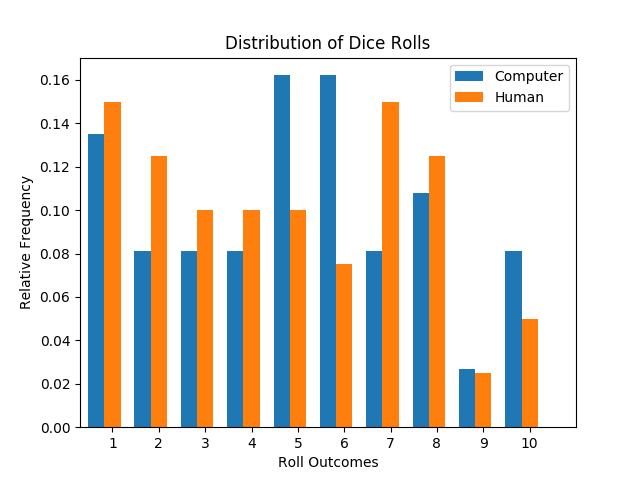
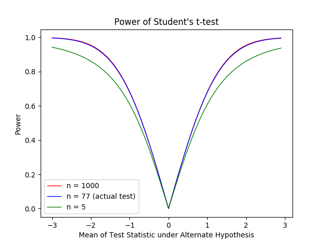

:date: 2018-11-17
:modified: 2018-11-18
:title: Does the Computer Cheat in Mario Party?
:category: Projects
:slug: mario-party

Introduction
------------

I happened to play the video game *Mario Party 5* with my brother
over a holiday. The game involves rolling dice to move your
character around a playing board. Since we seemed to be getting
lower rolls on average than the computer players, we wondered if
perhaps they were given an advantage somehow. I manually recorded
a sample of the dice rolls from the game in order to test this
possibility.

The data and code for this project can be found on GitHub_.

.. _GitHub: https://github.com/mmallicoat/mario-party

.. Style: Student's *t*-test; Mann–Whitney *U* test; Wilcoxon rank-sum test; (Pearson's) chi-squared test; Smirnov–Kolmogorov test; *p*-value

Distribution of Dice Rolls
--------------------------

Each turn, a player rolls a die which returns an integer value
from 1 to 10. Naively, we would assume that the die behaves like
physical dice: that is, that each outcome is equally likely. [#]_
The chart below shows the frequencies of the outcomes for the
computer and human players from my sample.

Simply looking at the frequencies, it does seem that the computer
players tend to get more very high rolls (9s and 10s) than the
human players and that the human player get more very low rolls
(1s and 2s), but we must do a statistical test to make a rigorous
assessment. We need to perform a goodness of fit test to determine
if our sample likely comes from the assumed distribution: a
discrete uniform distribution with support on [1, 10].

A simple and effective goodness of fit test is the chi-squared
test. [#]_ This compares the frequencies for each outcome to the
expected frequency under the null hypothesis that the outcomes are
equally likely. Performing the test, we get the following results:

==============  ======================  ====================
Player          Test Statistic          *p*-value
==============  ======================  ====================
Human           6.000                   0.740
Computer        5.973                   0.743
==============  ======================  ====================

The *p*-values are much higher than any reasonable significance
level, so we cannot reject the assumption that the dice is fair
for both the computer and human players.

Since our sample size is somewhat small, around 40 samples for
each type of player, the expected frequency is around 4 for each
possible outcome. This is less than the rule of thumb that you
should have a minimum expectation of 5 in each category; so,
our test results may not be reliable. We can resolve this by
instead *pooling* the results into five categories of outcomes:
rolls of 1 or 2, 3 or 4, 5 or 6, 7 or 8, and 9 or 10. This gives
an expectation for each category of about 8, which should be
sufficient. The new results are then:

==============  ======================  ====================
Player          Test Statistic          *p*-value
==============  ======================  ====================
Human           5.500                   0.240
Computer        4.757                   0.313  
==============  ======================  ====================

The *p*-values are lower than previously, but the test is still
inconclusive. Both dice appear to be fair.

.. [#] Additionally, we would expect each roll to be independent of
    the others, but I have not tested this hypothesis.

.. [#] I had first attempted to use the exact test of goodness of
    fit. This requires evaluating the CDF of a multinomial
    distribution. The CDF of the multinomial distribution
    is simply the summation of the pmf evaluated at the
    appropriate subset of the sample space. The size of the
    sample space is given by a `theorem in combinatorics
    <https://en.wikipedia.org/wiki/Stars_and_bars_(combinatorics)#Theorem_two>`__. The number of ways of arranging *n* objects into
    *k* ordered partitions is *n + k - 1 choose n*. So, for a
    10-dimensional multinomial distribution and a sample size of 40,
    this is *49 choose 40*, or 2,054,455,634 combinations. To evaluate
    the CDF at a particular value, a program would have to iterate
    through a loop as many as 2 billion times, calculating the pmf
    of one combination each time. Even using the ``multiprocessing``
    library to take advantage of the two processor cores on my laptop,
    I estimate this would take 5.5 hours. I don't think the additional
    accuracy of the exact test over the chi-squared test is worth the
    computational time.

Mean Dice Roll
--------------

Although we are unable to discern that the dice are anything but
fair, the mean dice roll for the computer players is 5.14, which
is slightly higher than the mean for the human players of 4.83.
Even if the outcomes of the dice rolls are close enough to fair
to avoid detection, there might still be some edge give to the
computer player. Instead of testing the distribution, we can
directly test whether the means of the two dice rolls are equal.

A common test of the means of two population is the Student's
*t*-test. This tests whether the difference of the means of the
two populations is significantly different than zero. The null
hypothesis is that the expected difference is exactly zero.

The results of this test show:

======================  ====================
Test Statistic          *p*-value
======================  ====================
0.496                   0.621
======================  ====================

With this large *p*-value, we cannot reject the null hypothesis
that the means are equal.

The Student's *t*-test assumes that the means of the samples are
normally distributed. This will be true asymptotically, proven
in the Central Limit Theorem. [#]_ Nevertheless, there exists
a nonparametric test which is almost as powerful as Student's
*t*-test in many contexts: the Mann–Whitney *U* test (also known
as the Wilcoxon sum-rank test). This tests the null hypothesis
that a random sample from one population is equally likely to
be greater than or less than a random sample from a second
population.

The results of the Mann–Whitney *U* test are:

======================  ====================
Test Statistic          *p*-value
======================  ====================
783.000                 0.663
======================  ====================

Again, these are inconclusive. We cannot reject the hypothesis
that the means are equal.

.. [#] We have already assumed that the samples are independent,
    but for the Central Limit Theorem to hold, the distribution of the
    populations must also have finite variances. Since the outcomes of
    the dice rolls are confined to the range [1, 10], this will be the
    case.

Power of Statistical Tests
--------------------------

.. Alternate title: Power Analysis

It is possible to computer the *power* of a statistical test: the
probability of rejecting the null hypothesis given that the null
hypothesis is actually false. The power of a test is a function of
the sample size and the value of the distribution parameters under
the alternate hypothesis. By computing the power of a test, we can
get a sense of if our sample size is sufficiently large to perform
a maximally powerful test.

Below is a plot of the power curve of Student's *t*-test for
various sample sizes.

We can see that, with a sample size of 77, our test is very
close the power curve of a test with a sample size of 1000.
Increasing the sample size of our test would only marginal
increase the power. Our sample size is large enough for performing
the Student's *t*-test at close to its maximum power. [#]_

.. [#] Student's *t* distribution is asymptotically normal as the
    number of the degree of freedom approaches infinity. This is why we
    see convergence in the power curves to some upper limit.

.. TODO: Plot power curve of chi-squared test as well

Conclusion
----------

It seems that the dice in this game are fair and that no advantage
is given to either the computer or human players. Or, if either
of these is not the case, the deviation is small enough that our
tests are not powerful enough to detect it.

However, there are additional ways that the game may still bend
the rules that we have not tested. For example, if a player
had a run of low rolls, the game might increase the probably
of a higher rolls subsequently, in order to make the game more
forgiving. We could test the assumption that the rolls are indeed
independent of each other. There exist many `tests of randomness
<https://en.wikipedia.org/wiki/Randomness_tests>`__ which can
discern "non-randomness" in a sample, even if the frequencies
of its outcomes match exactly the expected proportions.
