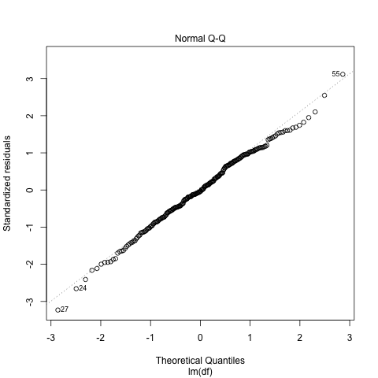
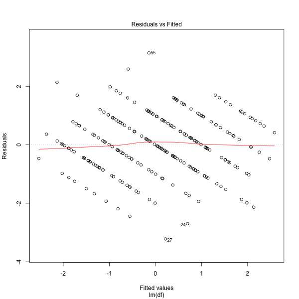

:title: Student Satisfaction Regression
:date: 2019-02-25
:modified: 2019-02-28
:slug: student-satisfaction
:category: Projects

.. Style: Student's *t*-test; Mann–Whitney *U* test; Wilcoxon rank-sum test;
    (Pearson's) chi-squared test; Smirnov–Kolmogorov test; *p*-value;
    *F*-test; en-dash in "Q–Q plot" not hyphen

Sears et al. [#Sears]_ performed a survey of psychology students at the
University of Calgary in order to better understand which factors lead to
students' satisfaction with their degree program. In this project, I perform a
regression analysis on the variables selected for this survey. [#data]_ The
code and data for this project can be found on GitHub_.

.. _GitHub: https://github.com/mmallicoat/student-satisfaction

.. [#Sears] Sears, Christopher R., et al. (2017). Predictors of Student
    Satisfaction in a Large Psychology Undergraduate Program.  *Canadian
    Psychology, 58*\ (2), 148–160. http://dx.doi.org/10.1037/cap0000082

.. [#data] This analysis uses *synthetic* data that was produced to
    imitate the data collected in the study itself.

Exploration
-----------

In the data, we have one response variable (:math:`y`) and ten explanatory
variables (:math:`X_1, X_2, \dots, X_10`). They represent the following
quantities, as assessed by each student in the survey:

*   :math:`y`: overall satisfaction with the psychology program
*   :math:`X_1`: quality of teaching in lectures
*   :math:`X_2`: quality of teaching in labs
*   :math:`X_3`: student-faculty interaction
*   :math:`X_4`: level of academic challenge
*   :math:`X_5`: opportunities for research experience
*   :math:`X_6`: variety of courses available
*   :math:`X_7`: opportunities for class discussions
*   :math:`X_8`: opportunities to write about views and ideas
*   :math:`X_9`: program advising
*   :math:`X_10`: career information

First, we read the data into our R program and calculate some descriptive
statistics.

.. code:: R

    # Read in data
    df <- read.csv('data/survey.csv')
    
    # Descriptive statistics
    df_mean <- sapply(df, mean)
    df_sd <- sapply(df, sd)

This gives us the mean and standard deviation of each variable:

===== ======= ======= ======= ======= ======= ======= ======= ======= ======= ======= =======
\     Y1      X1      X2      X3      X4      X5      X6      X7      X8      X9      X10
===== ======= ======= ======= ======= ======= ======= ======= ======= ======= ======= =======
Mean  0.076   0.127   -0.046  0.118   0.055   0.148   -0.051  -0.097  0.038   0.051   -0.097
SD    1.5     1.6     1.8     1.9     1.6     1.9     2.0     1.7     1.9     1.8     1.9
===== ======= ======= ======= ======= ======= ======= ======= ======= ======= ======= =======

The answers given to the survey questions were coded as integers from −3 (*very
unsatisfied*) to +3 (*very satisfied*), with 0 for *neutral*. The means of the
variables are all small and near 0, so the students' responses are likely
well-balanced in terms of satisfaction versus dissatisfaction.

Validating Assumptions
----------------------

The linear regression model makes a number of assumptions about the properties
of the data. These include the assumption that the explanatory variables are
linearly independent, or that they lack **perfect** multicollinearity. To
ensure the soundness of our model, we will check if any of our explanatory are
collinear.

Besides the theoretical assumption, there are practical reasons to avoid
even "imperfect" collinearity between explanatory variables:

*   In a multiple linear regression, we estimate the coefficients with
    the formula :math:`\hat{\beta} = (X^{T} X)^{-1} X^{T} y`. If two
    explanatory variables are collinear, the matrix :math:`X^{T} X`` will
    be near singular. This makes it computationally difficult to invert.

*   If two explanatory variables are collinear, the variance of
    their coefficients in the linear model will be very high.
    This reduces the power of the *t*-test used to determine
    if the coefficient is statistically significant.

A crude way to detect collinearity between variables is the look at their
correlation coefficient matrix. Large values (say, greater than 0.70) might
indicate collinearity.

.. code:: R

    df_correl <- cor(df)

The correlation coefficient matrix for our variables is:

===== ======= ======= ======= ======= ======= ======= ======= ======= ======= ======= =======
\     Y1      X1      X2      X3      X4      X5      X6      X7      X8      X9      X10
===== ======= ======= ======= ======= ======= ======= ======= ======= ======= ======= =======
Y1    1.00    0.63    0.40    0.51    0.56    0.44    0.30    0.36    0.54    0.30    0.45
X1    0.63    1.00    0.50    0.60    0.42    0.36    0.42    0.39    0.55    0.39    0.41
X2    0.40    0.50    1.00    0.34    0.39    0.22    0.31    0.33    0.27    0.18    0.27
X3    0.51    0.60    0.34    1.00    0.34    0.61    0.36    0.47    0.60    0.54    0.52
X4    0.56    0.42    0.39    0.34    1.00    0.39    0.29    0.34    0.29    0.32    0.35
X5    0.44    0.36    0.22    0.61    0.39    1.00    0.28    0.38    0.56    0.37    0.50
X6    0.30    0.42    0.31    0.36    0.29    0.28    1.00    0.32    0.34    0.30    0.33
X7    0.36    0.39    0.33    0.47    0.34    0.38    0.32    1.00    0.54    0.31    0.25
X8    0.54    0.55    0.27    0.60    0.29    0.56    0.34    0.54    1.00    0.46    0.48
X9    0.30    0.39    0.18    0.54    0.32    0.37    0.30    0.31    0.46    1.00    0.56
X10   0.45    0.41    0.27    0.52    0.35    0.50    0.33    0.25    0.48    0.56    1.00
===== ======= ======= ======= ======= ======= ======= ======= ======= ======= ======= =======

None of the correlation coefficients between the explanatory variables are
larger than 0.70, so there is no obvious sign of collinearity.

A more thorough way to detect multicollinearity is to compute the Variance Inflation
Factor (VIF) for each variable in the linear model. But to do this, we must first
fit the coefficients of our linear model. This is a one-liner in R:

.. code:: R

    md <- lm(df)

:math:`VIF_j` is defined as :math:`1 / (1 - R_{j}^{2})` where :math:`R_{j}^{2}`
is the coefficient of determination for explanatory variable :math:`j` when
*regressed on the other explanatory variables*. We are checking to see
:math:`X_j` can be predicted to a high degree of accuracy by a linear
combination of the other variables. If :math:`R_{j}^{2}` is large (that is,
that a large proportion of the variance of :math:`X_j` can be explained by the
other variables), then :math:`VIF_j` will be large. If the VIF for an
explanatory variable is larger than some threshold (say, 5), then we can
conclude that it is collinear and exclude it from our model.

Another view of the same quantity is *tolerance*, which is defined as the
reciprocal of the VIF.  Using the ``car`` library, we can calculate both of
these for our linear model:

.. code:: R

    vif_md <- vif(md)
    tol_md <- 1 / vif(md)

The VIFs and tolerances for our variables are:

=========== ======= ======= ======= ======= ======= ======= ======= ======= ======= =======
\           X1      X2      X3      X4      X5      X6      X7      X8      X9      X10
=========== ======= ======= ======= ======= ======= ======= ======= ======= ======= =======
VIF         2.2     1.5     2.6     1.5     2.0     1.3     1.6     2.3     1.7     1.8
Tolerance   0.45    0.68    0.39    0.68    0.50    0.76    0.62    0.44    0.58    0.55
=========== ======= ======= ======= ======= ======= ======= ======= ======= ======= =======

None of the VIFs are greater than 5 (or tolerances less than 0.2), so again it
seems that our variables are not collinear.

Another assumption of the linear regression that we should check is the
normality of the residuals. This can be done using a quantile–quantile (Q–Q)
plot of the empirical distribution of the residuals against a normal
distribution.

.. code:: R

    plot(md, 2)

Our observations fall close to the 45° line, so the residuals
are approximately normal.

Another assumption to check is the *homoscedasticity* of residuals, that is,
that they have the equal variance. We can check this by plotting the each
residual against the value that our model predicts for that observation. If
there is a linear relationship (for example, if the residuals tend to be larger
when the predicted value is larger), then homoscedasticity is violated.

.. code:: R

    plot(md, 1)

The red fitted line has close to 0 slope, so the residuals
are largely homoscedastic.

Selecting Variables in Model
----------------------------

Now that we have testing our assumptions, we can assess how well the model fits
the data. To start, we can look at the *t*-tests of the coefficients and the
*F*-test of the overall model.

.. code:: R

    summary(md)

.. code::

    Coefficients:
                Estimate Std. Error t value Pr(>|t|)    
    (Intercept)  0.01406    0.06867   0.205 0.837930    
    X1           0.32463    0.06375   5.092 7.45e-07 ***
    X2           0.02385    0.04661   0.512 0.609407    
    X3           0.06550    0.05630   1.164 0.245846    
    X4           0.30920    0.05058   6.113 4.25e-09 ***
    X5           0.02068    0.04950   0.418 0.676464    
    X6          -0.03563    0.03907  -0.912 0.362744    
    X7          -0.02678    0.05111  -0.524 0.600856    
    X8           0.17878    0.05331   3.354 0.000935 ***
    X9          -0.12363    0.04787  -2.583 0.010434 *  
    X10          0.11114    0.04760   2.335 0.020424 *  
    ---
    Signif. codes:  0 ‘***’ 0.001 ‘**’ 0.01 ‘*’ 0.05 ‘.’ 0.1 ‘ ’ 1
    
    Residual standard error: 1.033 on 226 degrees of freedom
    Multiple R-squared:  0.568,    Adjusted R-squared:  0.5488 
    F-statistic: 29.71 on 10 and 226 DF,  p-value: < 2.2e-16
    
We see that some of our explanatory variables have statistically significant
relationship with the response. The ones that do not we would like to remove,
as long as the fit of our model is not unduly reduced. If the true values for
the coefficients of these variables have small magnitude, then we should be
able to remove them without much harming the fit of our model.

To accomplish this, we can perform *backwards elimination*: one by one, we
remove insignificant variables from our model, testing if it leads to a
statistically significant decrease in the fit of the model. We can test the
significance of the change in :math:`R^2` between the two models using the
*F*-test. We repeat this procedure until all of the variables are significant
(using a significance level of 0.05).

Applying backwards elimination, we end up with a model that includes the
following variables:

*   :math:`X_1`: quality of teaching in lectures
*   :math:`X_4`: level of academic challenge
*   :math:`X_8`: opportunities to write about views and ideas
*   :math:`X_9`: program advising
*   :math:`X_10`: career information

Below is the summary of the *t*-tests and *F*-tests for this final model.

.. code::

    Coefficients:
                Estimate Std. Error t value Pr(>|t|)    
    (Intercept)  0.02603    0.06745   0.386   0.6999    
    X1           0.34397    0.05484   6.272 1.73e-09 ***
    X4           0.31227    0.04710   6.630 2.34e-10 ***
    X8           0.19050    0.04560   4.177 4.19e-05 ***
    X9          -0.11514    0.04577  -2.516   0.0126 *  
    X10          0.12527    0.04516   2.774   0.0060 ** 
    ---
    Signif. codes:  0 ‘***’ 0.001 ‘**’ 0.01 ‘*’ 0.05 ‘.’ 0.1 ‘ ’ 1
    
    Residual standard error: 1.029 on 231 degrees of freedom
    Multiple R-squared:  0.5617,    Adjusted R-squared:  0.5523 
    F-statistic: 59.22 on 5 and 231 DF,  p-value: < 2.2e-16
    
The :math:`R^2` for the final model is only 0.0063 less than the original. The
adjusted :math:`R^2`, which removes the spurious increase in :math:`R^2` that
is caused by adding unpredictive variables, is slightly *higher* in the final
model. Backwards elimination gives us a smaller model which explains nearly as
much of the variance in our response variable as the one using all of the
variables.

Next Steps
----------

There are some aspects of this regression that have not been addressed:

*   The `statistical data type`_ of our response variable is *ordinal*, not
    real-valued. The standard linear regression assumes that the response
    variable is normally distributed, which is clearly not the case here.
    I think, ideally, we would use an `ordinal regression`_ instead.

*   At the risk of overfitting, we might try capturing interaction between the
    explanatory variables by adding cross-product terms to the model like
    :math:`X_i X_j` where :math:`i \ne j`.

.. _`statistical data type`: https://en.wikipedia.org/wiki/Statistical_data_type
.. _`ordinal regression`: https://en.wikipedia.org/wiki/Ordinal_regression
